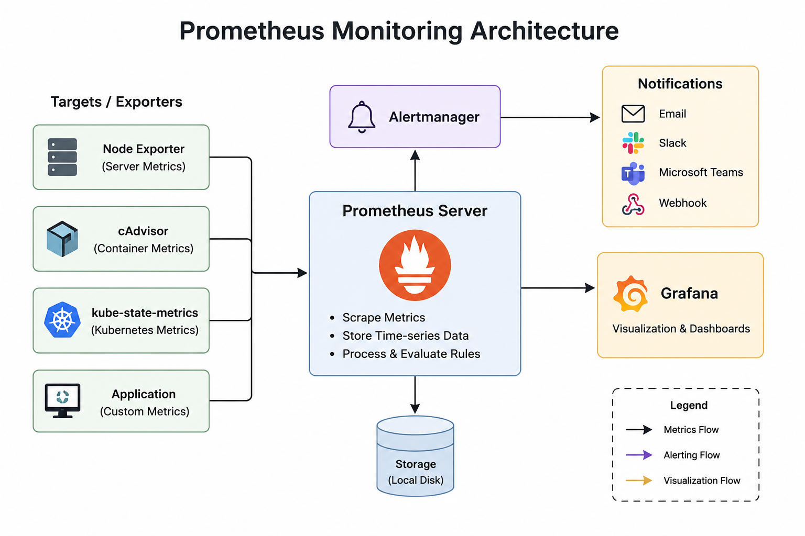

# Prometheus

## Overview

Prometheus is an open-source monitoring tool used to check the health and performance of applications, servers, and systems. It collects metrics like CPU usage, memory, request count, and errors, stores them over time, and helps us analyze system performance. It can also send alerts when something goes wrong. Prometheus is commonly used with Kubernetes and Grafana for monitoring and dashboards.

---

## Prometheus Architecture

  

---

## Components

### 1. Targets / Exporters

Targets/Exporters are the sources from which Prometheus collects metrics like CPU, memory, disk usage, network traffic, and application performance.

**Examples:**

- **Node Exporter** → Collects server metrics (CPU, Memory, Disk, Network).
- **cAdvisor** → Collects container metrics.
- **kube-state-metrics** → Collects Kubernetes resource metrics (Pods, Deployments, Nodes).
- **Application** → Exposes custom application metrics (Requests, Errors, Response Time).

---

### 2. Prometheus Server

Prometheus Server is the main component of Prometheus. It is responsible for collecting, storing, and monitoring metrics from applications and servers. It collects metrics from different targets, stores them as **time-series data**, and allows users to query and analyze the data using **PromQL**. It also evaluates alert rules and sends alerts to **Alertmanager** when the defined conditions are met.

---

### 3. Storage

Prometheus stores all collected metrics on local storage as **time-series data**.

It stores:

- CPU history
- Memory history
- Disk history
- Application metrics
- Kubernetes metrics

This historical data helps monitor system performance over time and troubleshoot issues.

---

### 4. Grafana

Grafana is used for visualization.

It does not collect metrics directly.

Instead, it queries Prometheus and displays the collected metrics in interactive dashboards.

Common dashboards include:

- CPU Usage
- Memory Usage
- Disk Usage
- Network Traffic
- Kubernetes Cluster Health
- Application Performance

---

### 5. Alertmanager

Prometheus sends alerts to Alertmanager when an alert rule is triggered.

Alertmanager is responsible for:

- Receiving alerts from Prometheus
- Grouping similar alerts
- Removing duplicate alerts
- Managing alert notifications

Example alert conditions:

- CPU Usage > 80%
- Memory Usage > 90%
- Pod Down
- Node Not Ready

---

### 6. Notifications

Alertmanager sends alerts through different notification channels.

**Examples:**

- 📧 Email
- 💬 Slack
- 👥 Microsoft Teams
- 🔗 Webhook

This ensures administrators are notified immediately whenever a critical issue occurs.

---

## Monitoring Workflow

1. Exporters collect metrics from servers, containers, Kubernetes, and applications.
2. Prometheus Server pulls metrics from these exporters.
3. Prometheus stores the metrics as time-series data.
4. Grafana queries Prometheus and displays dashboards.
5. Prometheus evaluates alert rules continuously.
6. When an alert condition is met, Prometheus sends the alert to Alertmanager.
7. Alertmanager sends notifications through Email, Slack, Microsoft Teams, or Webhooks.